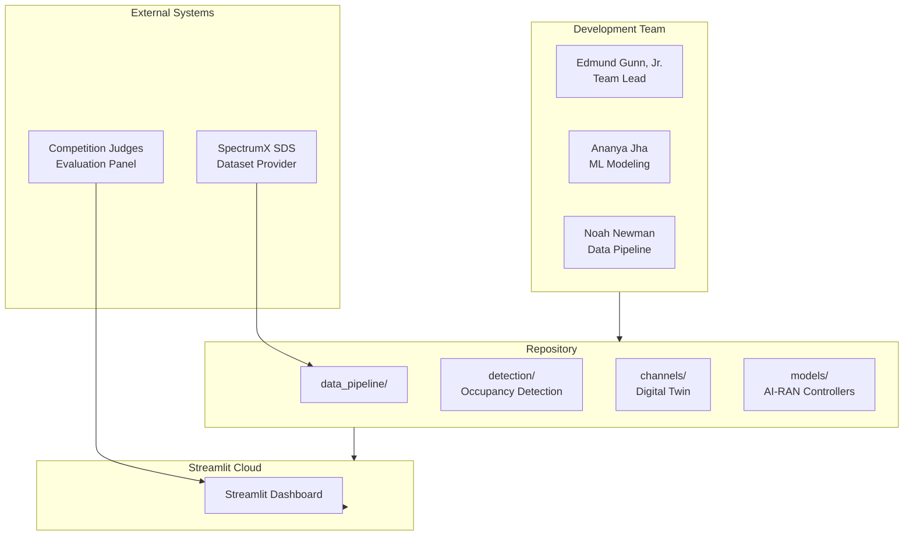
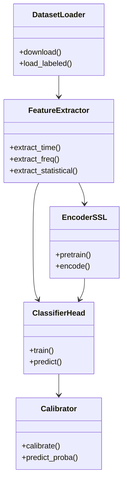

# EDGE-RAN Gary: AI-Native Radio for Equitable 6G Access

This repository contains our submission to the **SpectrumX Student Data & Algorithm Competition**.  
We treat the competition dataset as a mini-testbed and design an **AI-native RAN controller** that allocates radio resources under spectrum and energy constraints, with a focus on cities like **Gary, Indiana**.

## Problem

### Competition Core (Phase 1)

Given a 1-second IQ sample (complex-valued time series), determine whether the spectrum is **occupied** (signal present) or **unoccupied** (noise only). This is a binary classification problem with real-time inference requirements.

### Research Extension (Phase 2)

How can we design AI-driven radio resource management that:

- Respects spectral emission and coexistence constraints

- Improves spectral and energy efficiency

- Explicitly accounts for equity in mid-sized, under-resourced cities

## Approach

### Phase 1: Competition Core

- **Detection Pipeline**: Feature extraction → SSL/ML models → Calibration → Ensemble fusion
- **Baseline Methods**: Energy detector, spectral flatness detector
- **Advanced Models**: Self-supervised learning encoders, anomaly detection
- **Evaluation**: Accuracy, precision, recall, F1, AUC-ROC, calibration metrics

### Phase 2: Research Extension

- Build a lightweight **digital twin** of a Gary-like environment using open GIS data and ray-tracing style channels.

- Use the official **SpectrumX** dataset plus **DeepMIMO/Sionna**-style channels to emulate 6G-like propagation.

- Train an **AI-RAN controller** (contextual bandit / RL) to choose beams, power levels, and/or resource blocks under:

  - Spectral masks and power limits

  - Fairness constraints across users / neighborhoods

  - Energy-efficiency objectives

## Repository structure

- `src/edge_ran_gary/data_pipeline/`

  - `spectrumx_loader.py` — load and preprocess the competition dataset.

  - `deepmimo_scenarios.py` — helpers for DeepMIMO-style synthetic channels.

- `src/edge_ran_gary/channels/`

  - `sionna_scenes.py` — Sionna-based channel and link setups.

- `src/edge_ran_gary/models/`

  - `baselines.py` — classical heuristics and ML baselines.

  - `actor_critic.py` — RL / policy-gradient controller.

  - `bandit_policies.py` — contextual bandit approaches.

- `src/edge_ran_gary/sim/`

  - `environment.py` — simulation loop tying channels + models.

  - `evaluation.py` — metric computation and experiment drivers.

- `src/edge_ran_gary/utils/`

  - `metrics.py` — spectral efficiency, energy/bit, fairness, violation rates.

  - `plotting.py` — common plotting utilities.

- `notebooks/`

  - `00_eda.ipynb` — exploratory data analysis on the competition dataset.

  - `01_baselines.ipynb` — baselines and initial results.

  - `02_rl_policy.ipynb` — experiments with AI-RAN controllers.

- `docs/`

  - `project_one_pager.md` — high-level description (for proposals & teammates).

  - `experiments_log.md` — running log of experiments, configs, and results.

- `apps/`

  - `streamlit_app.py` — Streamlit dashboard for IQ data visualization and baseline model comparison.

- `src/edge_ran_gary/detection/`

  - `features.py` — Feature extraction from IQ samples (time, frequency, statistical).
  - `baselines.py` — Classical detection baselines (energy, spectral flatness).
  - `ssl.py` — Self-supervised learning encoders.
  - `anomaly.py` — Anomaly detection models for unsupervised scenarios.
  - `calibrate.py` — Confidence calibration.
  - `predict.py` — End-to-end inference pipeline.

- `src/edge_ran_gary/viz/`

  - `app_streamlit.py` — Streamlit visualization integration.

- `docs/architecture/`

  - `00_system_overview.md` — System architecture overview.
  - `10_dataflow.md` — Data flow and reproducibility documentation.

- `docs/uml/`

  - `system_context.mmd` — System context diagram (Mermaid).
  - `class_diagram_detection.mmd` — Detection module class diagram (Mermaid).
  - `sequence_inference.mmd` — Inference sequence diagram (Mermaid).
  - `containers_components.puml` — Component diagram (PlantUML).
  - `deployment_streamlit.puml` — Deployment diagram (PlantUML).

## Architecture

### Phase Separation

This repository implements a **two-phase architecture**:

1. **Competition Core (Phase 1)**: Real-time spectrum occupancy detection from 1-second IQ samples
   - Binary classification: occupied (signal present) vs. unoccupied (noise only)
   - Production-ready detection pipeline with baseline and ML models
   - Streamlit dashboard for visualization and model comparison

2. **Research Extension (Phase 2)**: Digital twin simulation with AI-RAN controller
   - Resource allocation (beams, power, resource blocks) under constraints
   - Fairness considerations for under-resourced communities
   - Demonstrates research vision beyond competition scope

This separation ensures competition judges can evaluate the core detection task independently, while Phase 2 showcases our broader research capabilities.

### System Context



### Detection Pipeline (Phase 1)

The competition core implements a complete detection pipeline:



### Documentation

- **[System Overview](docs/architecture/00_system_overview.md)**: Detailed architecture description
- **[Data Flow](docs/architecture/10_dataflow.md)**: Pipeline details and reproducibility contract
- **[UML Diagrams](docs/uml/)**: Complete UML documentation (Mermaid and PlantUML)

## Metrics

We will report:

- **Spectral efficiency** (bps/Hz/user)

- **Energy efficiency** (bits/Joule)

- **Fairness index** across users and neighborhoods

- **Constraint violation rate** for spectral masks and power limits

- **Latency / complexity** of the controller

## Tech stack

- Python 3.10+

- PyTorch for models

- Sionna / DeepMIMO-style channels for wireless simulations

- Jupyter + Matplotlib/Seaborn for analysis and visualization

- Streamlit + Plotly for interactive dashboard

## Streamlit Dashboard

### Local Setup

1. **Create virtual environment:**
   ```bash
   python -m venv .venv
   source .venv/bin/activate  # On Windows: .venv\Scripts\activate
   ```

2. **Install dependencies:**
   ```bash
   pip install -r requirements.txt
   ```

3. **Run the dashboard:**
   ```bash
   streamlit run apps/streamlit_app.py
   ```

The dashboard will open in your browser at `http://localhost:8501`.

### Streamlit Cloud Deployment (for Repository Owner)

To deploy on Streamlit Community Cloud:

1. **Push code to GitHub:**
   - Ensure all changes are committed and pushed to the `main` branch
   - Repository: `gunnchOS3k/spectrumx-ai-ran-gary`

2. **Deploy on Streamlit Cloud:**
   - Go to [share.streamlit.io](https://share.streamlit.io)
   - Sign in with GitHub
   - Click "New app"
   - Select repository: `gunnchOS3k/spectrumx-ai-ran-gary`
   - Branch: `main`
   - Main file path: `apps/streamlit_app.py`
   - Click "Deploy"

3. **Note on Dataset:**
   - The dashboard is designed to work with **user-uploaded .npy files**
   - No dataset files are committed to git (see `.gitignore`)
   - Users upload their own data files through the web interface
   - This allows deployment without requiring large dataset files in the repository

### Dashboard Features

- **File Upload**: Supports multiple IQ data formats (.npy files)
  - Complex arrays: `(N,)` with `complex64/complex128`
  - Float arrays: `(N, 2)` interpreted as `[I, Q]` pairs
  - int16 interleaved: `(N*2,)` with `[I0, Q0, I1, Q1, ...]` format

- **Baseline Models**:
  - Energy Detector (with tunable threshold)
  - Spectral Flatness Detector (with tunable threshold)
  - PSD+LogReg (placeholder for future implementation)

- **Visualizations**:
  - Time domain: I(t), Q(t), |x(t)|
  - IQ constellation scatter plot
  - Power Spectral Density (Welch method)
  - Spectrogram (STFT)

- **Prediction Panel**: Shows binary prediction (Signal/Noise) and confidence score

## Team

- **Edmund Gunn, Jr.** – Team lead; 6G / AI-RAN, digital twin design

- **Noah Newman** – Data pipeline, evaluation, visualization  
  - [LinkedIn](https://www.linkedin.com/in/noah-n-5a5943384)

- **Ananya Jha** – ML modeling, optimization, MLOps  
  - [LinkedIn](https://www.linkedin.com/in/ananya-jha-9968b01b7) | [GitHub](https://github.com/Ananya-Jha-code)

