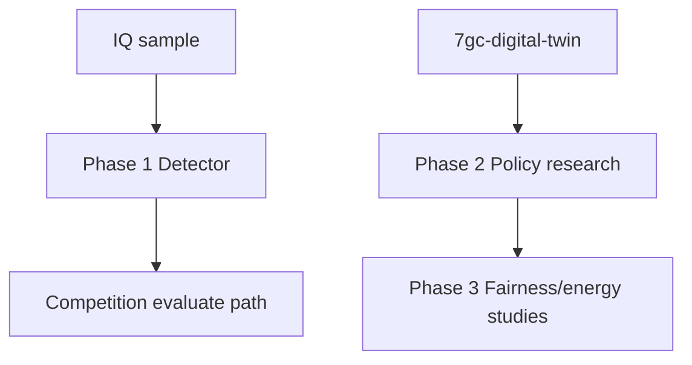

# EDGE-RAN Gary: AI-Native Radio for Equitable 6G Access
## End-to-End Research Artifact

| Item | Detail |
|------|--------|
| **Runs today** | Research prototype with smoke test (synthetic, non-evidence) |
| **Demo** | `make smoke` (smoke test only — not readiness proof) |
| **Data** | Synthetic only — no private IQ or PII |
| **Extend** | See [EXTERNAL_RESEARCHER_QUICKSTART.md](docs/EXTERNAL_RESEARCHER_QUICKSTART.md) |
| **Limits** | Not operational 6G; not Oulu affiliation; not carrier-grade |
| **Readiness** | [END_TO_END_READINESS.md](docs/END_TO_END_READINESS.md) |
| **Smoke test** | [E2E_RUN_RECORD.md](reproducibility/E2E_RUN_RECORD.md) |
| **Artifacts** | [results/e2e/](results/e2e/) |

This repository contains our submission to the **SpectrumX Student Data & Algorithm Competition**.  
We treat the competition dataset as a mini-testbed and design an **AI-native RAN controller** that allocates radio resources under spectrum and energy constraints, with a focus on cities like **Gary, Indiana**.


> **Portfolio guide:** [START_HERE](docs/START_HERE.md) · [Plain English](docs/PLAIN_ENGLISH_EXPLANATION.md) · [Evidence policy](docs/NO_MORE_TOY_DEMOS.md) · [What would make this final?](docs/WHAT_WOULD_MAKE_THIS_FINAL.md)

## Problem

### Competition Core (Phase 1)

Given a 1-second IQ sample (complex-valued time series), determine whether the spectrum is **occupied** (signal present) or **unoccupied** (noise only). This is a binary classification problem with real-time inference requirements.

### Research Extension (Phase 2)

How can we design AI-driven radio resource management that:

- Respects spectral emission and coexistence constraints

- Improves spectral and energy efficiency

- Explicitly accounts for equity in mid-sized, under-resourced cities

## Approach

### Phase 1: Competition Core

- **Detection Pipeline**: Feature extraction → SSL/ML models → Calibration → Ensemble fusion
- **Baseline Methods**: Energy detector, spectral flatness detector
- **Advanced Models**: Self-supervised learning encoders, anomaly detection
- **Evaluation**: Accuracy, precision, recall, F1, AUC-ROC, calibration metrics

### Phase 2: Research Extension

- Build a lightweight **digital twin** of a Gary-like environment using open GIS data and ray-tracing style channels.

- Use the official **SpectrumX** dataset plus **DeepMIMO/Sionna**-style channels to emulate 6G-like propagation.

- Train an **AI-RAN controller** (contextual bandit / RL) to choose beams, power levels, and/or resource blocks under:

  - Spectral masks and power limits

  - Fairness constraints across users / neighborhoods

  - Energy-efficiency objectives

## Quickstart

### 1. Install Dependencies

```bash
pip install -r requirements.txt
```

### 2. Generate Synthetic Twin Data

```bash
# Generate synthetic IQ dataset (2000 samples)
python -m edge_ran_gary.digital_twin.dataset_builder \
    --out data/synth_gary_twin \
    --n 2000 \
    --seed 123 \
    --config configs/digital_twin_gary.yaml
```

This creates:
- `data/synth_gary_twin/*.npy` - IQ data files
- `data/synth_gary_twin/metadata.csv` - Labels and metadata

### 3. Run Streamlit App

```bash
# Run locally (from repo root)
streamlit run streamlit_app.py
# or run the app file directly
streamlit run apps/streamlit_app.py
```

The app will open at `http://localhost:8501`. You can:
- Upload `.npy` files (from synthetic data or your own)
- Click "Generate Demo IQ Sample" to test without files
- View visualizations and run baseline detectors

### 4. Deploy to Streamlit Cloud

See [docs/STREAMLIT_DEPLOY.md](docs/STREAMLIT_DEPLOY.md) and [docs/STREAMLIT_CLOUD_DEPLOY.md](docs/STREAMLIT_CLOUD_DEPLOY.md) for deployment.

**Main file path (Cloud):** Use `streamlit_app.py` (repo root) or `apps/streamlit_app.py`. Both work; root wrapper imports `apps.streamlit_app`.

## Repository structure

- `src/edge_ran_gary/data_pipeline/`

  - `spectrumx_loader.py` — load and preprocess the competition dataset.

  - `deepmimo_scenarios.py` — helpers for DeepMIMO-style synthetic channels.

- `src/edge_ran_gary/channels/`

  - `sionna_scenes.py` — Sionna-based channel and link setups.

- `src/edge_ran_gary/models/`

  - `baselines.py` — classical heuristics and ML baselines.

  - `actor_critic.py` — RL / policy-gradient controller.

  - `bandit_policies.py` — contextual bandit approaches.

- `src/edge_ran_gary/sim/`

  - `environment.py` — simulation loop tying channels + models.

  - `evaluation.py` — metric computation and experiment drivers.

- `src/edge_ran_gary/utils/`

  - `metrics.py` — spectral efficiency, energy/bit, fairness, violation rates.

  - `plotting.py` — common plotting utilities.

- `notebooks/`

  - `00_eda.ipynb` — exploratory data analysis on the competition dataset.

  - `01_baselines.ipynb` — baselines and initial results.

  - `02_rl_policy.ipynb` — experiments with AI-RAN controllers.

- `docs/`

  - `project_one_pager.md` — high-level description (for proposals & teammates).

  - `experiments_log.md` — running log of experiments, configs, and results.

- `apps/`

  - `streamlit_app.py` — Streamlit dashboard for IQ data visualization and baseline model comparison.

- `src/edge_ran_gary/detection/`

  - `features.py` — Feature extraction from IQ samples (time, frequency, statistical).
  - `baselines.py` — Classical detection baselines (energy, spectral flatness).
  - `ssl.py` — Self-supervised learning encoders.
  - `anomaly.py` — Anomaly detection models for unsupervised scenarios.
  - `calibrate.py` — Confidence calibration.
  - `predict.py` — End-to-end inference pipeline.

- `src/edge_ran_gary/viz/`

  - `app_streamlit.py` — Streamlit visualization integration.

- `docs/architecture/`

  - `00_system_overview.md` — System architecture overview.
  - `10_dataflow.md` — Data flow and reproducibility documentation.

- `docs/uml/`

  - **[UML front door (`README.md`)](docs/uml/README.md)** — browse **`current/`**, **`future/`**, **`legacy/`** Markdown wrappers (GitHub-visible diagrams).
  - **[Current index](docs/uml/current/index.md)** — authoritative post-project diagrams; PlantUML also under `rendered/*.svg`.
  - Raw `*.mmd` / `*.puml` sources remain alongside wrappers; legacy-only artifacts are indexed under [`docs/uml/legacy/`](docs/uml/legacy/index.md).

## Architecture

### Phase Separation

This repository implements a **two-phase architecture**:

1. **Competition Core (Phase 1)**: Real-time spectrum occupancy detection from 1-second IQ samples
   - Binary classification: occupied (signal present) vs. unoccupied (noise only)
   - Production-ready detection pipeline with baseline and ML models
   - Streamlit dashboard for visualization and model comparison

2. **Research Extension (Phase 2)**: Gary digital twin + **detector-conditioned rule-based closed-loop policy baseline (RIC-style abstraction)** in Streamlit
   - Resource allocation *proxies* (beams, power, RBs) under scenario stress; separate `models/` code targets future bandit/RL study arms
   - Fairness considerations for under-resourced communities (three Gary civic anchors)
   - Demonstrates research vision beyond competition scope; see UML **current** extension diagrams

This separation ensures competition judges can evaluate the core detection task independently, while Phase 2 showcases our broader research capabilities.

### System Context

Post-project boundaries (Streamlit, submissions, external runtime targets): **[System context (current) — UML](docs/uml/current/system_context_current.md)**.

### Detection Pipeline (Phase 1)

Streamlit + submission inference contract (judged core): **[Class diagram — detection (current)](docs/uml/current/class_diagram_detection_current.md)**.

### Documentation

- **[System Overview](docs/architecture/00_system_overview.md)**: Detailed architecture description
- **[Data Flow](docs/architecture/10_dataflow.md)**: Pipeline details and reproducibility contract
- **[UML pack (front door)](docs/uml/README.md)**: GitHub-visible architecture diagrams (`current/` / `future/` / `legacy/`) plus committed PlantUML SVGs

## Metrics

We will report:

- **Spectral efficiency** (bps/Hz/user)

- **Energy efficiency** (bits/Joule)

- **Fairness index** across users and neighborhoods

- **Constraint violation rate** for spectral masks and power limits

- **Latency / complexity** of the controller

## Tech stack

- Python 3.10+

- PyTorch for models

- Sionna / DeepMIMO-style channels for wireless simulations

- Jupyter + Matplotlib/Seaborn for analysis and visualization

- Streamlit + Plotly for interactive dashboard

## Streamlit Dashboard

### Local Setup

1. **Create virtual environment:**
   ```bash
   python -m venv .venv
   source .venv/bin/activate  # On Windows: .venv\Scripts\activate
   ```

2. **Install dependencies:**
   ```bash
   pip install -r requirements.txt
   ```

3. **Run the dashboard:**
   ```bash
   streamlit run streamlit_app.py
   ```

   **Note:** Use the root-level `streamlit_app.py` wrapper for Cloud deployment compatibility.

The dashboard will open in your browser at `http://localhost:8501`.

### Streamlit Cloud Deployment (for Repository Owner)

To deploy on Streamlit Community Cloud:

1. **Push code to GitHub:**
   - Ensure all changes are committed and pushed to the `main` branch
   - Repository: `gunnchOS3k/spectrumx-ai-ran-gary`

2. **Deploy on Streamlit Cloud:**
   - Go to [share.streamlit.io](https://share.streamlit.io)
   - Sign in with GitHub
   - Click "New app"
   - Select repository: `gunnchOS3k/spectrumx-ai-ran-gary`
   - Branch: `main`
   - Main file path: `streamlit_app.py` (root level)
   - Click "Deploy"

   See [docs/STREAMLIT_DEPLOY.md](docs/STREAMLIT_DEPLOY.md) for troubleshooting.

3. **Note on Dataset:**
   - The dashboard is designed to work with **user-uploaded .npy files**
   - No dataset files are committed to git (see `.gitignore`)
   - Users upload their own data files through the web interface
   - This allows deployment without requiring large dataset files in the repository

### Dashboard Features

- **File Upload**: Supports multiple IQ data formats (.npy files)
  - Complex arrays: `(N,)` with `complex64/complex128`
  - Float arrays: `(N, 2)` interpreted as `[I, Q]` pairs
  - int16 interleaved: `(N*2,)` with `[I0, Q0, I1, Q1, ...]` format

- **Baseline Models**:
  - Energy Detector (with tunable threshold)
  - Spectral Flatness Detector (with tunable threshold)
  - PSD+LogReg (placeholder for future implementation)

- **Visualizations**:
  - Time domain: I(t), Q(t), |x(t)|
  - IQ constellation scatter plot
  - Power Spectral Density (Welch method)
  - Spectrogram (STFT)

- **Prediction Panel**: Shows binary prediction (Signal/Noise) and confidence score

## Digital Twin

The **Gary Spectrum Digital Twin** generates synthetic 1-second IQ windows for ML pipeline testing and robustness evaluation.

### Features

- **Zone-based modeling:** 12 zones with equity-focused weights
- **Reproducible generation:** Deterministic seeds and configs
- **Signal types:** QPSK-like and OFDM-like with impairments (CFO, multipath, AWGN)
- **Metadata tracking:** Labels, SNR, CFO, multipath taps per sample

### Usage

```python
from edge_ran_gary.digital_twin import generate_iq_window, build_synth_dataset

# Generate single window
iq_data, metadata = generate_iq_window(seed=123, label=1)

# Build full dataset
build_synth_dataset(
    output_dir="data/synth_gary_twin",
    n_samples=2000,
    seed=123
)
```

See [docs/DIGITAL_TWIN.md](docs/DIGITAL_TWIN.md) for full documentation.


## Portfolio & learner guide

---

## What is this?

**Spectrum occupancy detection (competition) plus AI-RAN-style resource policy research for equitable Gary-scale connectivity.**

| | |
|---|---|
| **Status** | Evidence-building repo · **Competition + research extension** |
| **Evidence today** | Level 1 smoke test — see [Evidence status](#evidence-status-smoke-test-vs-real-validation) |
| **Start** | [docs/START_HERE.md](docs/START_HERE.md) |

## What problem does this solve?

**Human:** Spectrum is scarce; unfair allocation leaves some neighborhoods with poor service during congestion.

**Technical:** Need calibrated detection + policy evaluation under spectrum, energy, and fairness constraints.

**Who is harmed if unsolved:** Urban residents in spectrum-constrained cities like Gary; competition evaluators need a safe core path.

**Gary / 7GC / digital equality:** This repo supports equitable connectivity research for under-connected communities; Gary is the flagship urban anchor where applicable.

## Beginner mental model

A **traffic-light controller for wireless resources**—deciding who gets green time on limited spectrum.

## How this repo addresses the problem

Phase 1: `evaluate(filename)` competition detector. Phase 2–3: digital twin + policy research (`src/airan_research/`, Streamlit).

**Main output:** Detector scores; research policy reports under `results/e2e/` (smoke until benchmarked).

**Output does NOT prove:** Conference-ready AI-RAN claims or carrier deployment proof.

## How this fits gunnchOS3k MLV

Gary AI-RAN brain connected to 7GC twin and Edge-IO; competition path preserved for judges.

Deep dive: [docs/HOW_THIS_FITS_GUNNCHOS.md](docs/HOW_THIS_FITS_GUNNCHOS.md) · [docs/CROSS_REPO_DEPENDENCY_MAP.md](docs/CROSS_REPO_DEPENDENCY_MAP.md) (where present)

## How this fits 6G PhD research

Relevant themes: **AI-native RAN · spectrum/energy efficiency · security/trust hooks · digital equality · wireless ML**

Oulu/CWC-style alignment (research direction, not affiliation claim): [docs/HOW_THIS_FITS_6G_PHD_RESEARCH.md](docs/HOW_THIS_FITS_6G_PHD_RESEARCH.md)

## What exists today

- Competition detection pipeline
- Streamlit dashboard
- Research extension modules
- UML architecture pack
- COMPETITION_SAFETY docs

Details: [docs/WHAT_IS_REAL_TODAY.md](docs/WHAT_IS_REAL_TODAY.md)

## Evidence status: smoke test vs real validation

- `make smoke` / `make e2e` = **CI smoke test** — proves code runs, **not** that research claims are field-validated.
- See [docs/NO_MORE_TOY_DEMOS.md](docs/NO_MORE_TOY_DEMOS.md) · [docs/EVIDENCE_STANDARD.md](docs/EVIDENCE_STANDARD.md) · [quality/CLAIMS_TO_EVIDENCE_MATRIX.md](quality/CLAIMS_TO_EVIDENCE_MATRIX.md)

**Next real evidence needed:**

- Benchmarked AI-RAN experiment
- 7GC scenario import validation
- Ablations + external reproduction

## Run or inspect this repo

```bash
python3 -m venv .venv && source .venv/bin/activate
pip install -r requirements.txt
make smoke
```

| | |
|---|---|
| **Output** | `results/e2e/ research cards` |
| **Means** | Reproducible smoke artifacts for CI and reviewers |
| **Does not mean** | Conference, adoption, or manufacturing readiness |

Video: [docs/video_walkthrough_script.md](docs/video_walkthrough_script.md)

## Visual map


```mermaid
flowchart TB
  IQ[IQ sample] --> P1[Phase 1 Detector]
  P1 --> Comp[Competition evaluate path]
  Twin[7gc-digital-twin] --> P2[Phase 2 Policy research]
  P2 --> P3[Phase 3 Fairness/energy studies]
```

More diagrams: [docs/diagrams/README.md](docs/diagrams/README.md) (if present) · [docs/uml/README.md](docs/uml/README.md) (spectrumx)

## Start here based on who you are

| Reader | Start here | You will learn |
|--------|------------|----------------|
| Beginner | [docs/PLAIN_ENGLISH_EXPLANATION.md](docs/PLAIN_ENGLISH_EXPLANATION.md) | Idea without jargon |
| Student / WAIKE | [docs/AUDIENCE_GUIDE.md](docs/AUDIENCE_GUIDE.md) | Learning path |
| Researcher / professor | [docs/HOW_THIS_FITS_6G_PHD_RESEARCH.md](docs/HOW_THIS_FITS_6G_PHD_RESEARCH.md) | Research fit |
| Contributor | [CONTRIBUTING.md](CONTRIBUTING.md) or Issues | How to help |
| City / school partner | [docs/PROBLEM_SOLUTION_MAP.md](docs/PROBLEM_SOLUTION_MAP.md) | Why it matters locally |

## What would make this final?

**Not satisfied yet** for final / conference / adoption / manufacturing gates—see audit:

- [docs/WHAT_WOULD_MAKE_THIS_FINAL.md](docs/WHAT_WOULD_MAKE_THIS_FINAL.md)
- [quality/FINAL_READINESS_CONFIRMATION.md](quality/FINAL_READINESS_CONFIRMATION.md)

## Roadmap from current state to final readiness

| Gate | Status |
|------|--------|
| Concept | Met |
| Smoke test | Met (`make smoke`) |
| Real evidence pipeline | Open |
| Benchmark / field data | Open |
| Internal validation | Open |
| External reproduction | Open |
| Candidate release | Open |
| Final | Not claimed |

Full table: [quality/READINESS_GATE_TABLE.md](quality/READINESS_GATE_TABLE.md)

## Related repos in the 7GC research spine


| Repo | Role |
|------|------|
| [7gc-digital-twin](https://github.com/gunnchOS3k/7gc-digital-twin) | Community digital twin spine |
| [spectrumx-ai-ran-gary](https://github.com/gunnchOS3k/spectrumx-ai-ran-gary) | AI-RAN + SpectrumX competition path |
| [readygary-6g-beam-selection](https://github.com/gunnchOS3k/readygary-6g-beam-selection) | Beam selection / PHY-facing evidence |
| [edge-io-measurement-node](https://github.com/gunnchOS3k/edge-io-measurement-node) | Privacy-first edge measurement |
| [ntn-resilience-sim](https://github.com/gunnchOS3k/ntn-resilience-sim) | NTN + terrestrial resilience |
| [waike-research-ops](https://github.com/gunnchOS3k/waike-research-ops) | Education & workforce pipeline |
| [gunnchos-hardware-industrial-design](https://github.com/gunnchOS3k/gunnchos-hardware-industrial-design) | Device hardware EVT planning |
| [gunnchos-device-os](https://github.com/gunnchOS3k/gunnchos-device-os) | School/research device OS prototype |
| [gunnchAI3k](https://github.com/gunnchOS3k/gunnchAI3k) | Learning assistant (where relevant) |


## Claims and non-claims

**Supports today:** Runnable scaffold, documented methods, smoke-test artifacts, honest limitations.

**Does not prove yet:** Conference-ready AI-RAN claims or carrier deployment proof.

**Requires evidence issues:** See GitHub `[Evidence TODO]` issues and `quality/CLAIMS_TO_EVIDENCE_MATRIX.md`.

---

## Team

- **Edmund Gunn, Jr.** – Team lead; 6G / AI-RAN, digital twin design

- **Noah Newman** – Data pipeline, evaluation, visualization  
  - [LinkedIn](https://www.linkedin.com/in/noah-n-5a5943384)

- **Ananya Jha** – ML modeling, optimization, MLOps  
  - [LinkedIn](https://www.linkedin.com/in/ananya-jha-9968b01b7) | [GitHub](https://github.com/Ananya-Jha-code)


## Where this repo sits in the gunnchOS3k MLV 7GC AI-RAN Digital Twin Program

**Gary flagship node** for community-scale AI-RAN research. Phase 1 preserves the competition-safe spectrum occupancy detector. Phase 2–3 extend toward the [7GC digital twin](https://github.com/gunnchOS3k/7gc-digital-twin) and [Edge-IO measurement](https://github.com/gunnchOS3k/edge-io-measurement-node) endpoints.

> Research prototype — not operational carrier 6G infrastructure.
