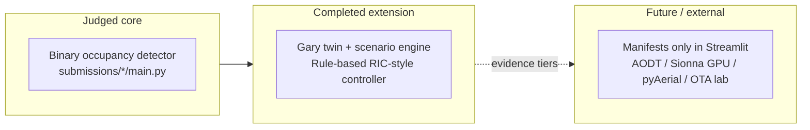

# UML and architecture diagrams

Post-project documentation for **spectrumx-ai-ran-gary**: current deployed reality, honest extension scope, and **future research-adoption** targets. Diagrams separate:

| Lane | Meaning |
|------|---------|
| **Judged competition core** | Binary occupancy on official SpectrumX IQ; `submissions/*/main.py` + offline evaluation |
| **Completed research extension** | Gary digital twin (three anchors), scenario engine, **detector-conditioned rule-based closed-loop policy baseline (RIC-style abstraction)** |
| **Future scaling / external runtime** | AODT, full Sionna RT, pyAerial/cuPHY execution, OTA/Data Lake capture — manifests and docs in-repo; execution mostly **external** |

**Canonical evidence terms:** `docs/PROVENANCE_LEGEND.md`  
**Execution boundaries:** `docs/EXTERNAL_RUNTIME_GAPS.md`  
**Three Gary anchors:** Gary City Hall · Gary Public Library & Cultural Center · West Side Leadership Academy  

**Controller (current, all diagrams):** *Detector-conditioned rule-based closed-loop policy baseline (RIC-style abstraction)* — state = detector belief + traffic/coexistence/fairness/coverage stress; actions = hold, cautious, power, channel, prioritize, rebalance; transition = heuristic KPI deltas. **Not** a trained RL or contextual-bandit policy in the shipped Streamlit path.

**Future controller ladder (when shown):** rule-based baseline → contextual-bandit study arm → constrained offline RL / near-RT RIC surrogate.

---

## How to read this folder

- **Mermaid** (`.mmd`): open in GitHub via Markdown embed, or use [Mermaid Live Editor](https://mermaid.live). Source files here are **plain Mermaid** (no markdown fences inside the file).
- **PlantUML** (`.puml`): render with [PlantUML](https://plantuml.com/) locally, IDE plugin, or CI; see `render_plantuml.sh` if present.

---

## A. Current system

| Diagram | Format | Purpose |
|---------|--------|---------|
| [system_context_current.mmd](system_context_current.mmd) | Mermaid | Actors, boundaries, manifest vs external runtime |
| [container_view_current.puml](container_view_current.puml) | PlantUML | Major containers / packages |
| [component_view_current.puml](component_view_current.puml) | PlantUML | Components and data flow |
| [deployment_current.puml](deployment_current.puml) | PlantUML | Where code runs today (local, GitHub, Cloud, external) |

---

## B. Current workflows

| Diagram | Format | Purpose |
|---------|--------|---------|
| [sequence_competition_inference_current.mmd](sequence_competition_inference_current.mmd) | Mermaid | IQ → evaluate / baselines → result |
| [sequence_judge_review_flow.mmd](sequence_judge_review_flow.mmd) | Mermaid | Judge Mode narrative |
| [sequence_extension_scenario_to_kpi_current.puml](sequence_extension_scenario_to_kpi_current.puml) | PlantUML | Scenario → rule-based controller → KPIs |
| [activity_signal_lifecycle_current.mmd](activity_signal_lifecycle_current.mmd) | Mermaid | One-second IQ lifecycle (competition-style) |
| [activity_signal_ecology_extension_current.mmd](activity_signal_ecology_extension_current.mmd) | Mermaid | Extension “signal ecology” (scenario-generated / illustrative) |
| [sequence_simulation_manifest_ingestion.puml](sequence_simulation_manifest_ingestion.puml) | PlantUML | Manifest loaders + provenance finalize (no fake local AODT/pyAerial/OTA execution) |

---

## C. Current use cases

| Diagram | Format | Purpose |
|---------|--------|---------|
| [use_cases_competition_core.puml](use_cases_competition_core.puml) | PlantUML | Judges, developers, evaluators |
| [use_cases_research_extension_current.puml](use_cases_research_extension_current.puml) | PlantUML | Twin, provenance, controller semantics |

---

## D. Future research-adoption architecture

**Explicitly target / not fully deployed.**

| Diagram | Format | Purpose |
|---------|--------|---------|
| [system_context_future_research_adoption.puml](system_context_future_research_adoption.puml) | PlantUML | External sim, AODT, PHY, OTA, stakeholders |
| [deployment_future_research_adoption.puml](deployment_future_research_adoption.puml) | PlantUML | Artifacts flowing back to repo/app |
| [component_view_future_research_stack.puml](component_view_future_research_stack.puml) | PlantUML | Future stack + controller ladder |
| [use_cases_future_research_adoption.puml](use_cases_future_research_adoption.puml) | PlantUML | Lab / city / supervisor workflows |

---

## E. Structure, state, and rigor

| Diagram | Format | Purpose |
|---------|--------|---------|
| [class_diagram_detection_current.mmd](class_diagram_detection_current.mmd) | Mermaid | Actual submission + detection modules in-repo |
| [class_diagram_extension_current.mmd](class_diagram_extension_current.mmd) | Mermaid | Scenario engine, hooks, pyAerial/OTA abstractions |
| [state_provenance_evidence.mmd](state_provenance_evidence.mmd) | Mermaid | Six evidence tiers + three execution surfaces |
| [state_controller_maturity_ladder.mmd](state_controller_maturity_ladder.mmd) | Mermaid | Current rule baseline vs planned study arms |
| [activity_experiment_program_current_to_future.puml](activity_experiment_program_current_to_future.puml) | PlantUML | Experiment program → evidence tiers → external validation |

---

## F. Diagram legend (terminology)

---

## G. Legacy / superseded diagrams

These reflected an **earlier aspirational** package layout (e.g. Bandit/RL as deployed Streamlit controllers, generic SSL pipeline as the only path). **Do not use for post-project accuracy.** Prefer the `*_current*` and `*_future_*` files above.

| Legacy file | Issue |
|-------------|--------|
| [system_context.mmd](system_context.mmd) | Wrong repo topology; RL/notebooks over-emphasized |
| [containers_components.puml](containers_components.puml) | Bandit/RL/sim as primary extension flow |
| [deployment_streamlit.puml](deployment_streamlit.puml) | Narrow; no external-runtime boundary |
| [sequence_inference.mmd](sequence_inference.mmd) | SSL/Ensemble/Calibrator path not matching default Streamlit `evaluate()` |
| [class_diagram_detection.mmd](class_diagram_detection.mmd) | Many classes not wired as shown for dashboard inference |
| [class_diagram_ml.mmd](class_diagram_ml.mmd) | Research aspirational stack |

---

## Related docs

- [../architecture/00_system_overview.md](../architecture/00_system_overview.md) — narrative (update in prose if diagrams disagree; diagrams here reflect **Streamlit + hooks** truth for judges)
- [../PROVENANCE_LEGEND.md](../PROVENANCE_LEGEND.md)
- [../EXTERNAL_RUNTIME_GAPS.md](../EXTERNAL_RUNTIME_GAPS.md)
- [../AODT_EXPORT_CHECKLIST.md](../AODT_EXPORT_CHECKLIST.md)
- [../PYAERIAL_BRIDGE.md](../PYAERIAL_BRIDGE.md)
