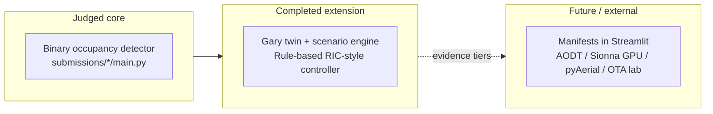

# UML and architecture diagrams — front door

Post-project, **GitHub-visible** architecture package for **spectrumx-ai-ran-gary**. Judges, faculty, collaborators, and system architects should start here with **Markdown pages** (`docs/uml/current/`, `future/`, `legacy/`) — **not** raw `.puml` or `.mmd` files.

## Lanes (how to read the repo)

| Lane | Meaning |
|------|---------|
| **Judged competition core** | Binary occupancy on official SpectrumX IQ; `submissions/*/main.py` + offline evaluation; Judge Mode microscope |
| **Completed research extension** | Gary digital twin (**three anchors below**), scenario engine, **detector-conditioned rule-based closed-loop policy baseline (RIC-style abstraction)** |
| **Future research-adoption** | AODT, full Sionna RT, pyAerial/cuPHY execution, OTA / data lake — **manifests and integration targets**; execution mostly **external** |

**Three Gary anchors (current scope):** Gary City Hall · Gary Public Library & Cultural Center · West Side Leadership Academy.

**Controller (current, authoritative):** *Detector-conditioned rule-based closed-loop policy baseline (RIC-style abstraction)* — **not** trained RL or contextual-bandit in the shipped Streamlit path. Planned arms appear only as **future** on the maturity ladder.

**Canonical evidence terms:** [`docs/PROVENANCE_LEGEND.md`](../PROVENANCE_LEGEND.md)  
**Execution boundaries:** [`docs/EXTERNAL_RUNTIME_GAPS.md`](../EXTERNAL_RUNTIME_GAPS.md)  
**System narrative:** [`docs/architecture/00_system_overview.md`](../architecture/00_system_overview.md)

---

## Browse the diagrams (primary entry points)

| Index | Contents |
|-------|----------|
| **[Current index](current/index.md)** | Post-project truth: context, container, component, deployment, sequences, activities, state, class, use cases |
| **[Future index](future/index.md)** | Research-adoption **targets** (context, stack, deployment, use cases, experiment program) |
| **[Legacy index](legacy/index.md)** | Superseded diagrams — **do not cite** as current |

**Governance / adoption aids**

- [Traceability matrix](traceability_matrix.md) — lanes ↔ diagrams  
- [Interface / integration catalog](interface_catalog.md) — `evaluate()`, CSV, manifests, provenance, pyAerial bridge, OTA  
- [Architecture decision summary](architecture_decisions.md) — concise AD-style rationale  

---

## Source vs rendered assets

| Asset | Role on GitHub |
|-------|----------------|
| **`docs/uml/current/*.md`**, **`future/*.md`**, **`legacy/*.md`** | **Primary:** Mermaid in fenced ` ```mermaid ` blocks renders inline; PlantUML pages embed **committed SVG** |
| **`*.mmd`**, **`*.puml`** in `docs/uml/` | **Preserved sources** for editors and regeneration; not the main reader path |
| **`docs/uml/rendered/*.svg`** | **Committed** PlantUML output for inline display (stable filenames) |

PlantUML sources use `!pragma layout smetana` where needed so SVG generation does **not** require a system **Graphviz** `dot` install.

---

## Documentation governance

- **Current** — shipped behavior and honest boundaries (`current/`).  
- **Future** — adoption and validation targets; may outrun implementation (`future/`).  
- **Legacy** — historical or over-aspirational diagrams; kept for provenance (`legacy/`).  
- **Updating diagrams** — edit the `.puml` / `.mmd` source, then refresh the matching `.md` wrapper if Mermaid text is duplicated, and regenerate SVGs for PlantUML.  
- **Regenerating SVGs** — from repo root:

```bash
./docs/uml/render_plantuml.sh
```

Or manually (after placing `plantuml.jar` under `docs/uml/.tools/`):

```bash
cd docs/uml && java -jar .tools/plantuml.jar -tsvg -o rendered ./*.puml
```

See `render_plantuml.sh` for Java/JAR setup and dependency hints.

---

## Mini legend (terminology)



---

## Legacy naming (do not confuse)

| Legacy (historical) | Authoritative current |
|---------------------|------------------------|
| `class_diagram_detection.mmd` | `class_diagram_detection_current.mmd` → [wrapper](current/class_diagram_detection_current.md) |
| `system_context.mmd` | `system_context_current.mmd` → [wrapper](current/system_context_current.md) |
| `sequence_inference.mmd` | `sequence_competition_inference_current.mmd` → [wrapper](current/sequence_competition_inference_current.md) |
| `containers_components.puml` | `container_view_current.puml` + [container MD](current/container_view_current.md) |

Full legacy table: [legacy/index.md](legacy/index.md).

---

## Related docs

- [`docs/AODT_EXPORT_CHECKLIST.md`](../AODT_EXPORT_CHECKLIST.md)  
- [`docs/PYAERIAL_BRIDGE.md`](../PYAERIAL_BRIDGE.md)
