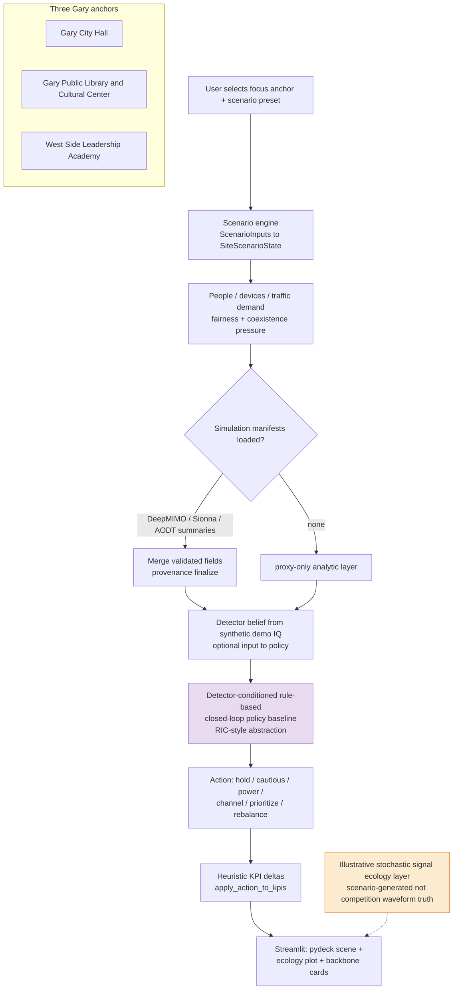

# Activity — signal ecology (completed extension)

| | |
|---|---|
| **Status** | **Current extension** — scenario-driven UI layer |
| **Purpose** | Anchor the three Gary sites, scenario engine, manifest merge vs proxy, **detector-conditioned rule-based closed-loop policy baseline (RIC-style abstraction)**, and ecology visualization. |
| **Source** | [`docs/uml/activity_signal_ecology_extension_current.mmd`](../activity_signal_ecology_extension_current.mmd) |

The stochastic ecology layer is **scenario-generated / illustrative**, not competition waveform ground truth.

[← Current index](index.md)
