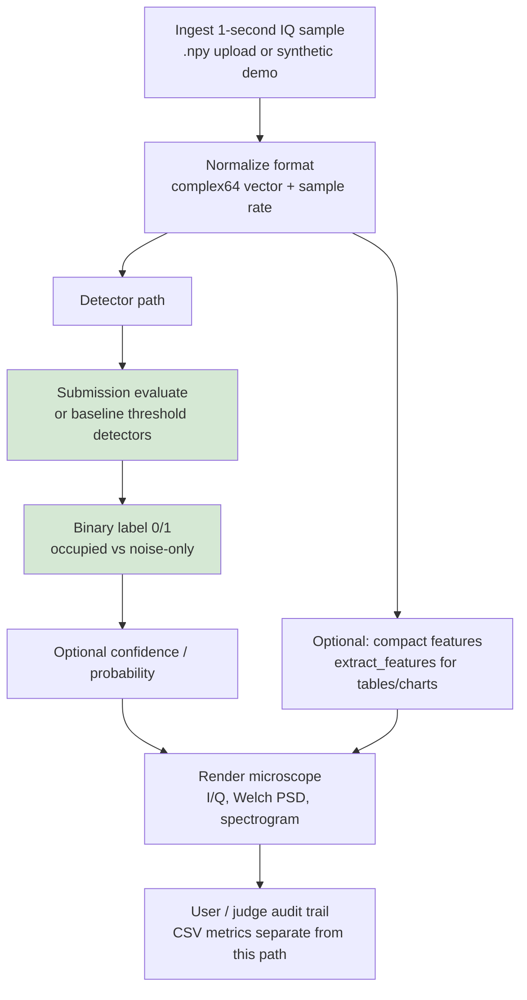

# Activity — signal lifecycle (current, competition-style)

| | |
|---|---|
| **Status** | **Current** — one-second IQ path |
| **Purpose** | End-to-end flow from ingest through detector path to visualization and audit separation from CSV metrics. |
| **Source** | [`docs/uml/activity_signal_lifecycle_current.mmd`](../activity_signal_lifecycle_current.mmd) |

[← Current index](index.md)
