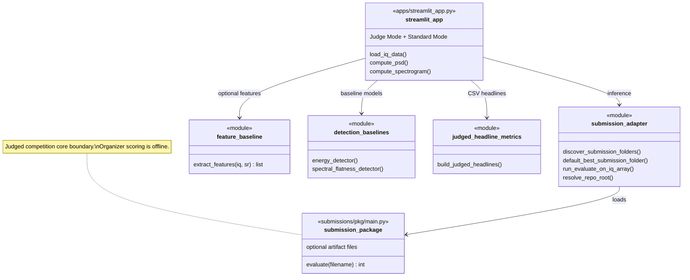

# Class diagram — detection / judged competition core (current)

| | |
|---|---|
| **Status** | **Current** — modules wired for Streamlit + submissions |
| **Purpose** | Bound `submission_adapter`, `submissions/*/main.py` (`evaluate`), baselines, and Streamlit responsibilities. |
| **Source** | [`docs/uml/class_diagram_detection_current.mmd`](../class_diagram_detection_current.mmd) |

For historical aspirational stacks, see [legacy class diagram (detection)](../legacy/class_diagram_detection_legacy.md).

[← Current index](index.md)
