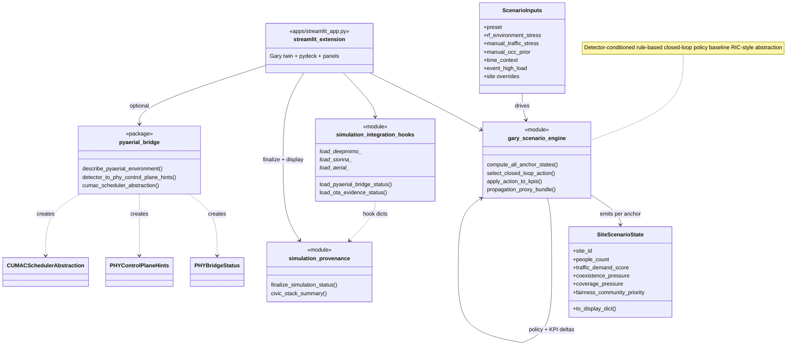

# Class diagram — extension / scenario / hooks (current)

| | |
|---|---|
| **Status** | **Current** — Gary extension + integration hooks |
| **Purpose** | Model scenario inputs/state, `gary_scenario_engine`, manifest hooks, provenance finalize, and pyAerial bridge **abstractions**. |
| **Source** | [`docs/uml/class_diagram_extension_current.mmd`](../class_diagram_extension_current.mmd) |

**Controller:** *Detector-conditioned rule-based closed-loop policy baseline (RIC-style abstraction)* — `select_closed_loop_action` / `apply_action_to_kpis`. Full PHY execution remains an **external** target.

[← Current index](index.md)
