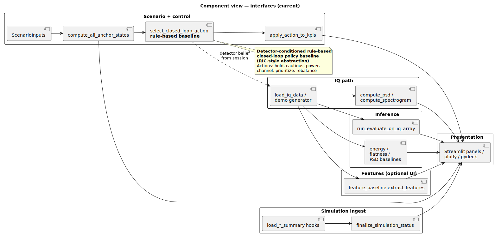

# Component view — current interfaces

| | |
|---|---|
| **Status** | **Current** |
| **Purpose** | IQ path, detector path, judged metrics, extension scenario/provenance, and external-runtime boundary notes. |
| **Rendered** | [`docs/uml/rendered/component_view_current.svg`](../rendered/component_view_current.svg) |
| **Source** | [`docs/uml/component_view_current.puml`](../component_view_current.puml) |

**Source (PlantUML):** [component_view_current.puml](../component_view_current.puml)

[← Current index](index.md)
