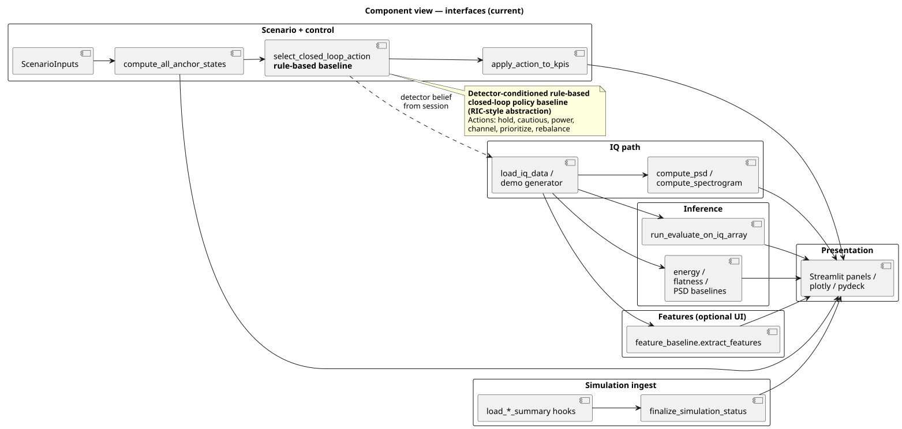
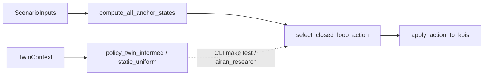

# Component view — current interfaces

| | |
|---|---|
| **Status** | **Current** |
| **Purpose** | IQ path, detector path, judged metrics, extension scenario/provenance, and external-runtime boundary notes. |
| **Rendered** | [`docs/uml/rendered/component_view_current.svg`](../rendered/component_view_current.svg) |
| **Source** | [`docs/uml/component_view_current.puml`](../component_view_current.puml) |

**Audit (this checkout):** Gate 2 `src/airan_research/gate2/twin_policies.py` is a **completed** rule-based / SLSQP policy path, not shown in the committed SVG until `./docs/uml/render_plantuml.sh` is re-run. Source PlantUML now includes that rectangle. Controller remains **not RL**.

```mermaid
flowchart LR
  SI[ScenarioInputs] --> CAS[compute_all_anchor_states]
  CAS --> POL[select_closed_loop_action]
  POL --> KPI[apply_action_to_kpis]
  TC[TwinContext] --> G2[policy_twin_informed / static_uniform]
  G2 -.->|CLI make test / airan_research| POL
```

**Source (PlantUML):** [component_view_current.puml](../component_view_current.puml)

[← Current index](index.md)
