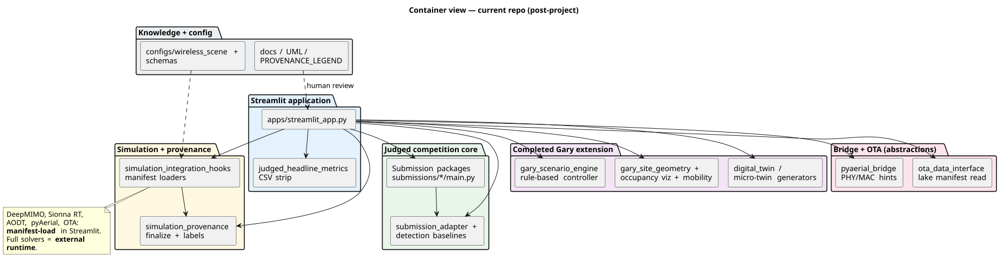

# Container view — current repo

| | |
|---|---|
| **Status** | **Current** |
| **Purpose** | High-level containers: judged core, Streamlit, Gary extension, simulation + provenance, bridge/OTA abstractions, knowledge/config. |
| **Rendered** | [`docs/uml/rendered/container_view_current.svg`](../rendered/container_view_current.svg) |
| **Source** | [`docs/uml/container_view_current.puml`](../container_view_current.puml) |

**Audit (this checkout):** `src/airan_research` (Gate 2) is a completed extension **beside** Streamlit, invoked by `make test` / `python -m airan_research`. PlantUML source updated; re-render SVG when `plantuml.jar` is available. Still **rule-based**, not RL.

**Source (PlantUML):** [container_view_current.puml](../container_view_current.puml)

[← Current index](index.md)
