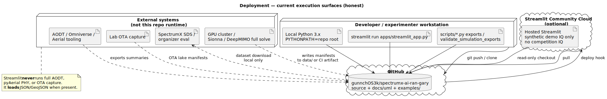

# Deployment — current execution surfaces

| | |
|---|---|
| **Status** | **Current** — honest execution boundaries |
| **Purpose** | Where Python, Streamlit, GitHub, optional cloud, and **external** simulators/OTA fit. |
| **Rendered** | [`docs/uml/rendered/deployment_current.svg`](../rendered/deployment_current.svg) |
| **Source** | [`docs/uml/deployment_current.puml`](../deployment_current.puml) |

**Source (PlantUML):** [deployment_current.puml](../deployment_current.puml)

See also: [`docs/EXTERNAL_RUNTIME_GAPS.md`](../../EXTERNAL_RUNTIME_GAPS.md).

[← Current index](index.md)
