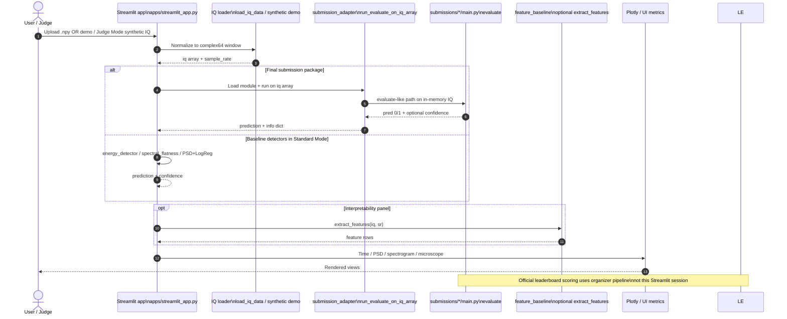

# Sequence — competition inference (current)

| | |
|---|---|
| **Status** | **Current** — Streamlit + `evaluate()` path |
| **Purpose** | Trace upload/demo IQ through loaders, submission adapter, optional baselines, and UI visualization. |
| **Source** | [`docs/uml/sequence_competition_inference_current.mmd`](../sequence_competition_inference_current.mmd) |

Official leaderboard scoring remains **organizer-offline**; this sequence is the **in-app** audit and demo path.

[← Current index](index.md)
