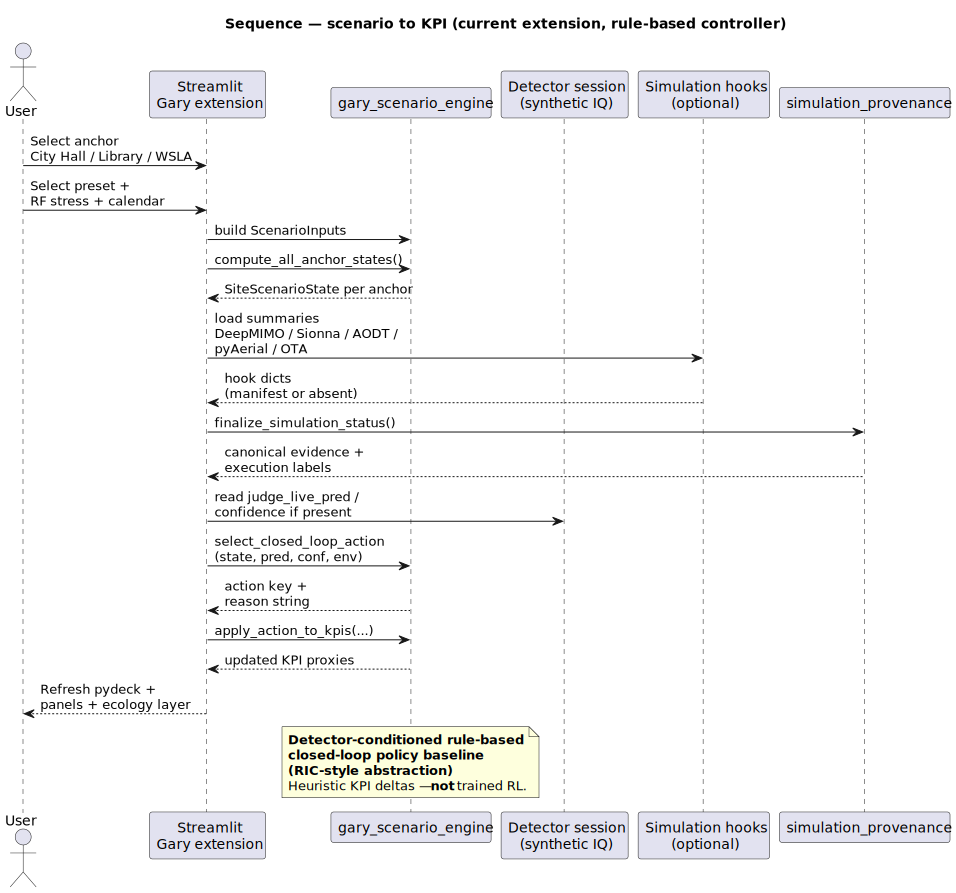

# Sequence — extension scenario to KPI (current)

| | |
|---|---|
| **Status** | **Current** |
| **Purpose** | Scenario inputs → engine → **rule-based** policy actions → KPI updates → Streamlit panels. |
| **Rendered** | [`docs/uml/rendered/sequence_extension_scenario_to_kpi_current.svg`](../rendered/sequence_extension_scenario_to_kpi_current.svg) |
| **Source** | [`docs/uml/sequence_extension_scenario_to_kpi_current.puml`](../sequence_extension_scenario_to_kpi_current.puml) |

**Source (PlantUML):** [sequence_extension_scenario_to_kpi_current.puml](../sequence_extension_scenario_to_kpi_current.puml)

[← Current index](index.md)
