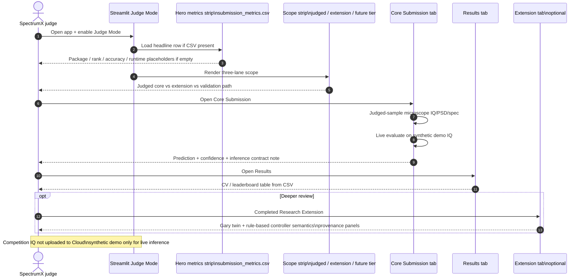

# Sequence — judge review flow

| | |
|---|---|
| **Status** | **Current** — Judge Mode UX narrative |
| **Purpose** | How a SpectrumX judge navigates headline metrics, scope lanes, core submission, results, and optional extension. |
| **Source** | [`docs/uml/sequence_judge_review_flow.mmd`](../sequence_judge_review_flow.mmd) |

Competition IQ is **not** uploaded to Cloud; synthetic demo supports live inference contract review.

[← Current index](index.md)
