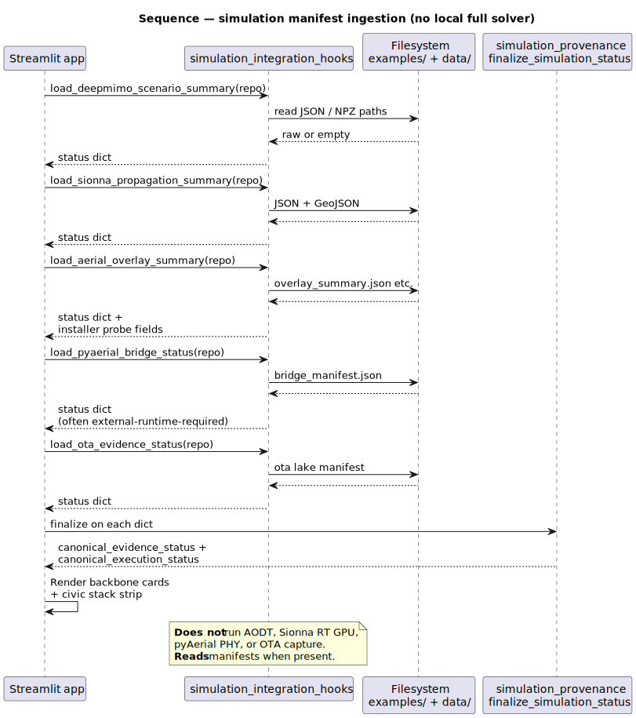

# Sequence — simulation manifest ingestion

| | |
|---|---|
| **Status** | **Current** |
| **Purpose** | Load validated manifest fields, finalize provenance, and **avoid** implying local AODT/pyAerial/OTA execution inside Streamlit. |
| **Rendered** | [`docs/uml/rendered/sequence_simulation_manifest_ingestion.svg`](../rendered/sequence_simulation_manifest_ingestion.svg) |
| **Source** | [`docs/uml/sequence_simulation_manifest_ingestion.puml`](../sequence_simulation_manifest_ingestion.puml) |

**Source (PlantUML):** [sequence_simulation_manifest_ingestion.puml](../sequence_simulation_manifest_ingestion.puml)

[← Current index](index.md)
