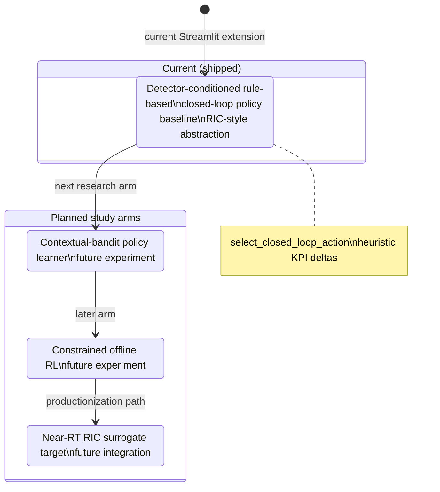

# State — controller maturity ladder

| | |
|---|---|
| **Status** | **Current vs planned** — honest labeling |
| **Purpose** | Show shipped **rule-based RIC-style baseline** versus **future** study arms (contextual bandit, offline RL, RIC surrogate). |
| **Source** | [`docs/uml/state_controller_maturity_ladder.mmd`](../state_controller_maturity_ladder.mmd) |

**Current (shipped):** *Detector-conditioned rule-based closed-loop policy baseline (RIC-style abstraction)*. Contextual-bandit and RL are **not** claimed as deployed controllers.

[← Current index](index.md)
