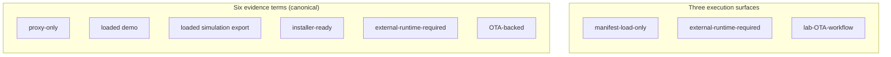

# State — provenance and evidence vocabulary

| | |
|---|---|
| **Status** | **Current** — documentation contract |
| **Purpose** | Relate the six canonical evidence terms to three execution surfaces (manifest-load, external runtime, lab OTA). |
| **Source** | [`docs/uml/state_provenance_evidence.mmd`](../state_provenance_evidence.mmd) |

Authoritative definitions: [`docs/PROVENANCE_LEGEND.md`](../../PROVENANCE_LEGEND.md).

[← Current index](index.md)
