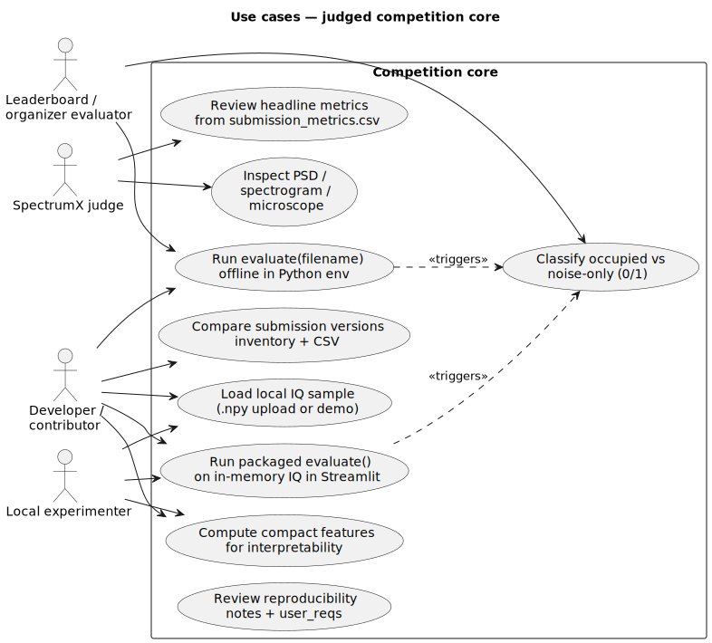

# Use cases — judged competition core

| | |
|---|---|
| **Status** | **Current** |
| **Purpose** | Judges, developers, and evaluators around submissions and offline scoring. |
| **Rendered** | [`docs/uml/rendered/use_cases_competition_core.svg`](../rendered/use_cases_competition_core.svg) |
| **Source** | [`docs/uml/use_cases_competition_core.puml`](../use_cases_competition_core.puml) |

**Source (PlantUML):** [use_cases_competition_core.puml](../use_cases_competition_core.puml)

[← Current index](index.md)
