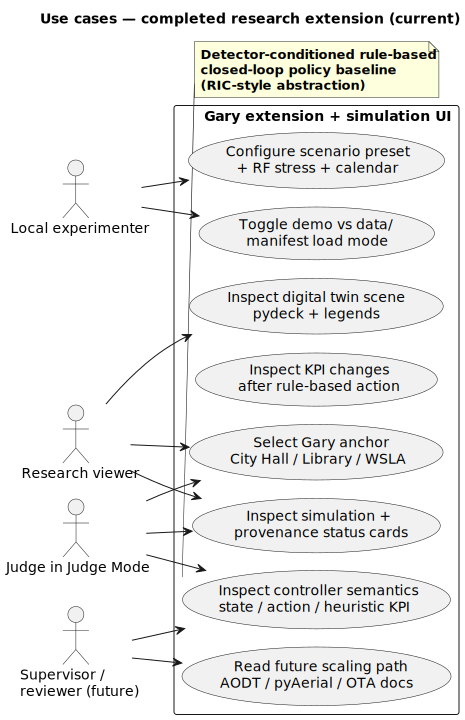

# Use cases — completed research extension (current)

| | |
|---|---|
| **Status** | **Current** |
| **Purpose** | Twin navigation, provenance, **detector-conditioned rule-based closed-loop policy baseline (RIC-style abstraction)**, and manifest literacy. |
| **Rendered** | [`docs/uml/rendered/use_cases_research_extension_current.svg`](../rendered/use_cases_research_extension_current.svg) |
| **Source** | [`docs/uml/use_cases_research_extension_current.puml`](../use_cases_research_extension_current.puml) |

**Source (PlantUML):** [use_cases_research_extension_current.puml](../use_cases_research_extension_current.puml)

[← Current index](index.md)
