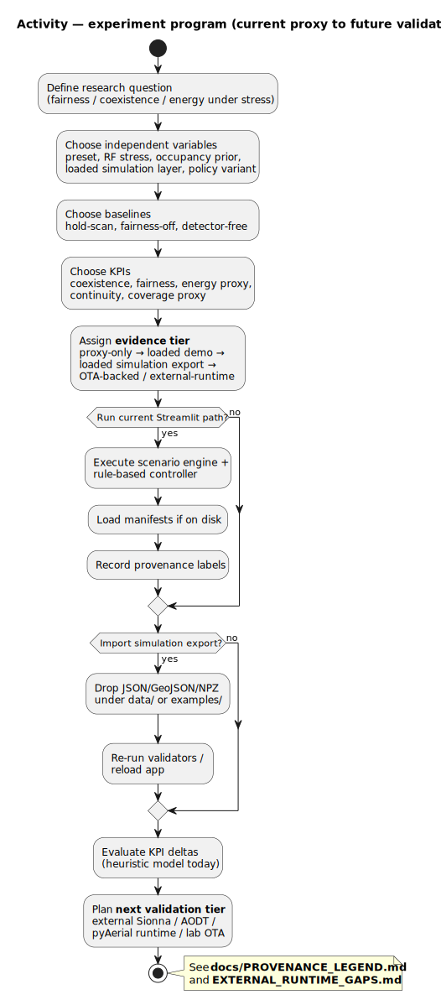

# Activity — experiment program (current proxy → future validation)

| | |
|---|---|
| **Status** | **Mixed** — frames how today’s runs point toward future evidence tiers |
| **Purpose** | Experiment design → proxy/demo/sim-export paths → external validation and OTA-backed evidence. |
| **Rendered** | [`docs/uml/rendered/activity_experiment_program_current_to_future.svg`](../rendered/activity_experiment_program_current_to_future.svg) |
| **Source** | [`docs/uml/activity_experiment_program_current_to_future.puml`](../activity_experiment_program_current_to_future.puml) |

**Source (PlantUML):** [activity_experiment_program_current_to_future.puml](../activity_experiment_program_current_to_future.puml)

[← Future index](index.md)
