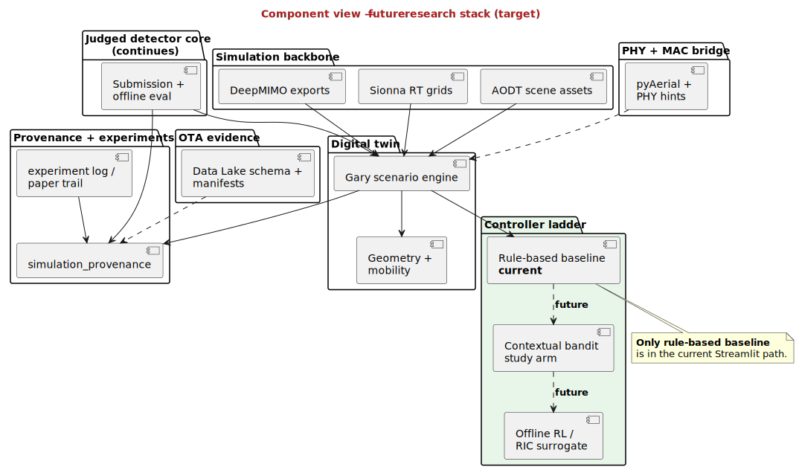

# Component view — future research stack (target)

| | |
|---|---|
| **Status** | **Future / target** |
| **Purpose** | Future stack including controller **ladder** (rule baseline → bandit study → offline RL → RIC surrogate) as **research targets**, not current deployment claims. |
| **Rendered** | [`docs/uml/rendered/component_view_future_research_stack.svg`](../rendered/component_view_future_research_stack.svg) |
| **Source** | [`docs/uml/component_view_future_research_stack.puml`](../component_view_future_research_stack.puml) |

**Source (PlantUML):** [component_view_future_research_stack.puml](../component_view_future_research_stack.puml)

**Current shipped controller** remains the rule-based baseline; see [Controller maturity ladder](../current/state_controller_maturity_ladder.md).

[← Future index](index.md)
