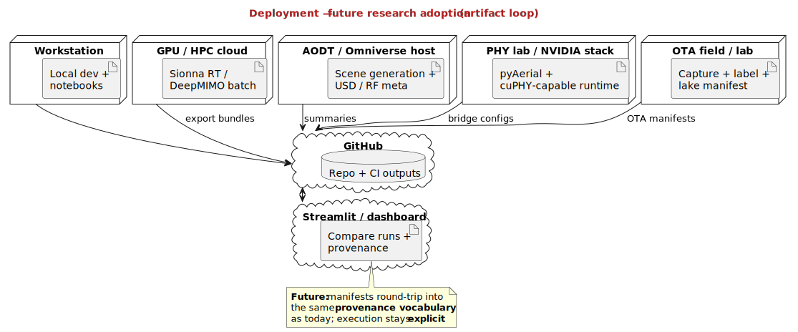

# Deployment — future research adoption (artifact loop)

| | |
|---|---|
| **Status** | **Future / target** |
| **Purpose** | How lab/GPU/OTA artifacts would flow back into repo, app, and evidence tiers. |
| **Rendered** | [`docs/uml/rendered/deployment_future_research_adoption.svg`](../rendered/deployment_future_research_adoption.svg) |
| **Source** | [`docs/uml/deployment_future_research_adoption.puml`](../deployment_future_research_adoption.puml) |

**Source (PlantUML):** [deployment_future_research_adoption.puml](../deployment_future_research_adoption.puml)

[← Future index](index.md)
