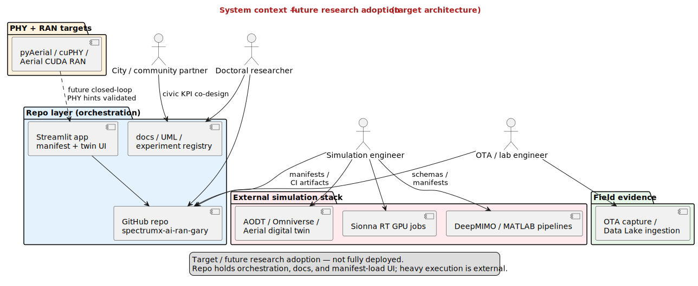

# System context — future research adoption (target)

| | |
|---|---|
| **Status** | **Future / target** — explicit adoption architecture |
| **Purpose** | Widen actors and systems: external sim, AODT, PHY stack, OTA, supervisors — as **targets** for validation loops. |
| **Rendered** | [`docs/uml/rendered/system_context_future_research_adoption.svg`](../rendered/system_context_future_research_adoption.svg) |
| **Source** | [`docs/uml/system_context_future_research_adoption.puml`](../system_context_future_research_adoption.puml) |

**Source (PlantUML):** [system_context_future_research_adoption.puml](../system_context_future_research_adoption.puml)

[← Future index](index.md)
