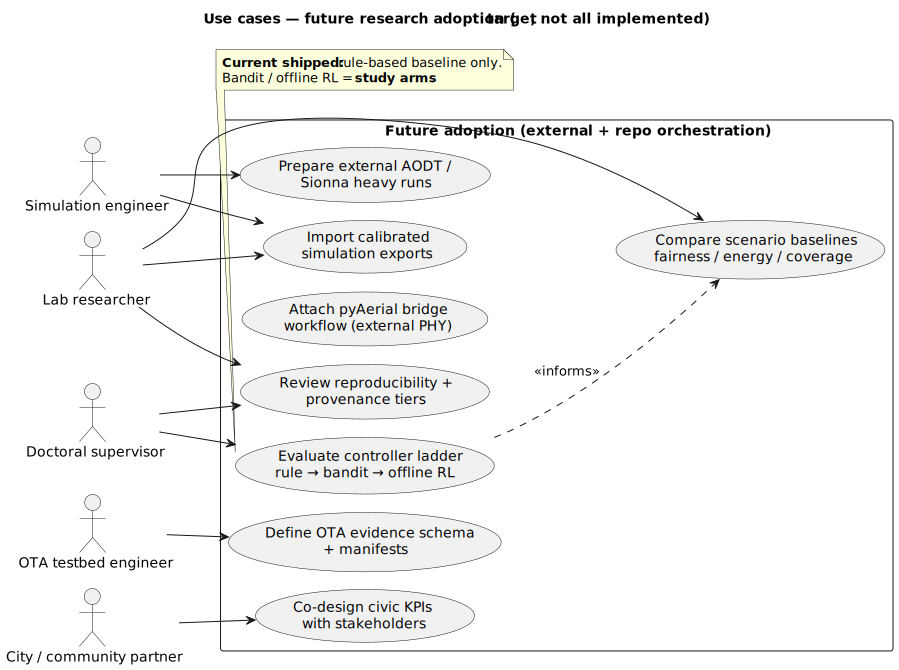

# Use cases — future research adoption (target)

| | |
|---|---|
| **Status** | **Future / target** — not all implemented |
| **Purpose** | Lab, city, and supervisor workflows for adoption-scale operation. |
| **Rendered** | [`docs/uml/rendered/use_cases_future_research_adoption.svg`](../rendered/use_cases_future_research_adoption.svg) |
| **Source** | [`docs/uml/use_cases_future_research_adoption.puml`](../use_cases_future_research_adoption.puml) |

**Source (PlantUML):** [use_cases_future_research_adoption.puml](../use_cases_future_research_adoption.puml)

[← Future index](index.md)
