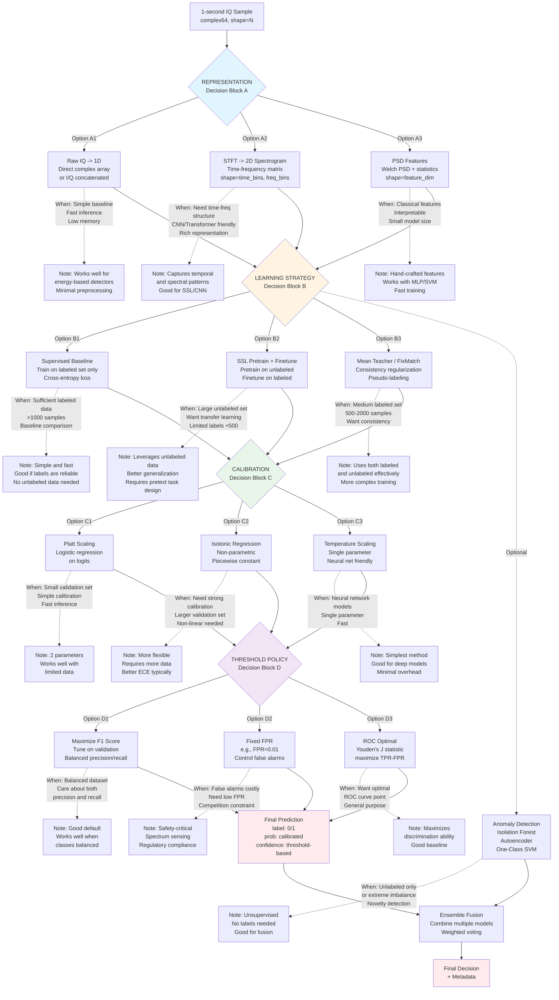

# LEGACY — modeling decision map

| | |
|---|---|
| **Status** | **Legacy** — historical design exploration |
| **Purpose (historical)** | Representation / learning / calibration / threshold decision blocks. |
| **Source** | [`docs/uml/ananya_modeling_map.mmd`](../ananya_modeling_map.mmd) |
| **Prefer** | [Class diagram detection (current)](../current/class_diagram_detection_current.md) |

[← Legacy index](index.md)
