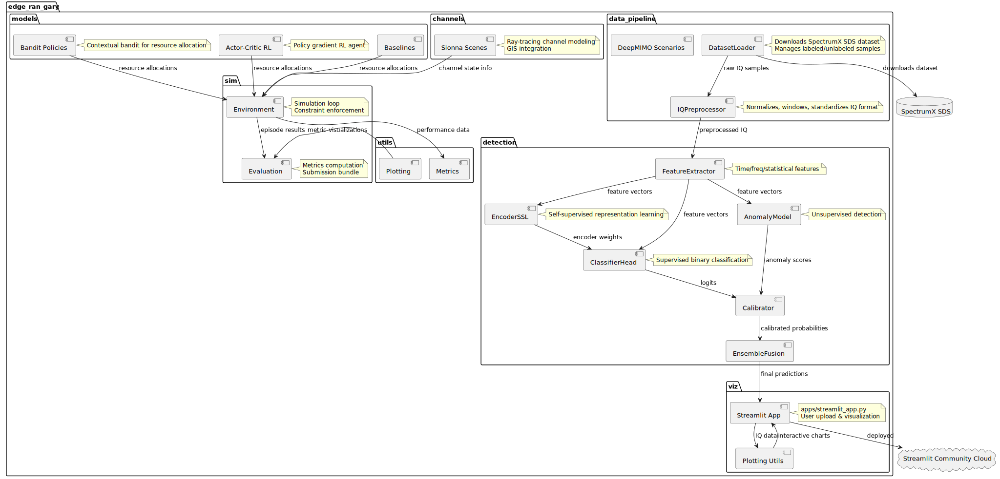

# LEGACY — containers and components (superseded PlantUML)

| | |
|---|---|
| **Status** | **Legacy** |
| **Why archived** | Bandit/RL/sim shown as primary extension flow; superseded by current container/component views. |
| **Rendered** | [`docs/uml/rendered/containers_components.svg`](../rendered/containers_components.svg) |
| **Source** | [`docs/uml/containers_components.puml`](../containers_components.puml) |
| **Prefer** | [Container view (current)](../current/container_view_current.md), [Component view (current)](../current/component_view_current.md) |

**Source (PlantUML):** [containers_components.puml](../containers_components.puml)

[← Legacy index](index.md)
