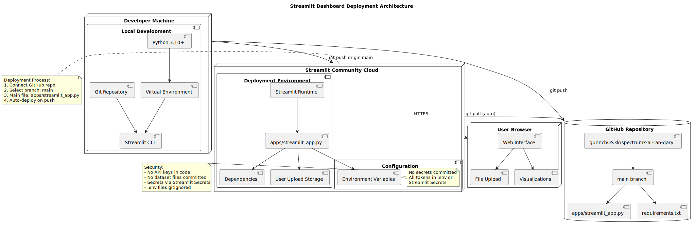

# LEGACY — deployment (Streamlit-only narrow view)

| | |
|---|---|
| **Status** | **Legacy** |
| **Why archived** | Too narrow; missing external-runtime boundary honesty. |
| **Rendered** | [`docs/uml/rendered/deployment_streamlit.svg`](../rendered/deployment_streamlit.svg) |
| **Source** | [`docs/uml/deployment_streamlit.puml`](../deployment_streamlit.puml) |
| **Prefer** | [Deployment (current)](../current/deployment_current.md) |

**Source (PlantUML):** [deployment_streamlit.puml](../deployment_streamlit.puml)

[← Legacy index](index.md)
