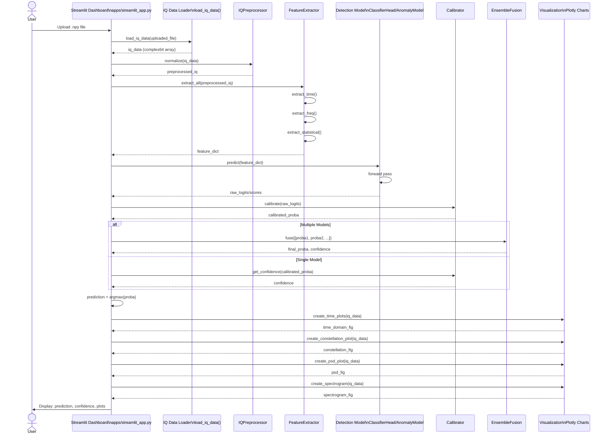

# LEGACY — sequence inference (SSL / ensemble path)

| | |
|---|---|
| **Status** | **Legacy** |
| **Why archived** | Does not match default Streamlit `evaluate()` / submission adapter path. |
| **Source** | [`docs/uml/sequence_inference.mmd`](../sequence_inference.mmd) |
| **Prefer** | [Competition inference (current)](../current/sequence_competition_inference_current.md) |

[← Legacy index](index.md)
