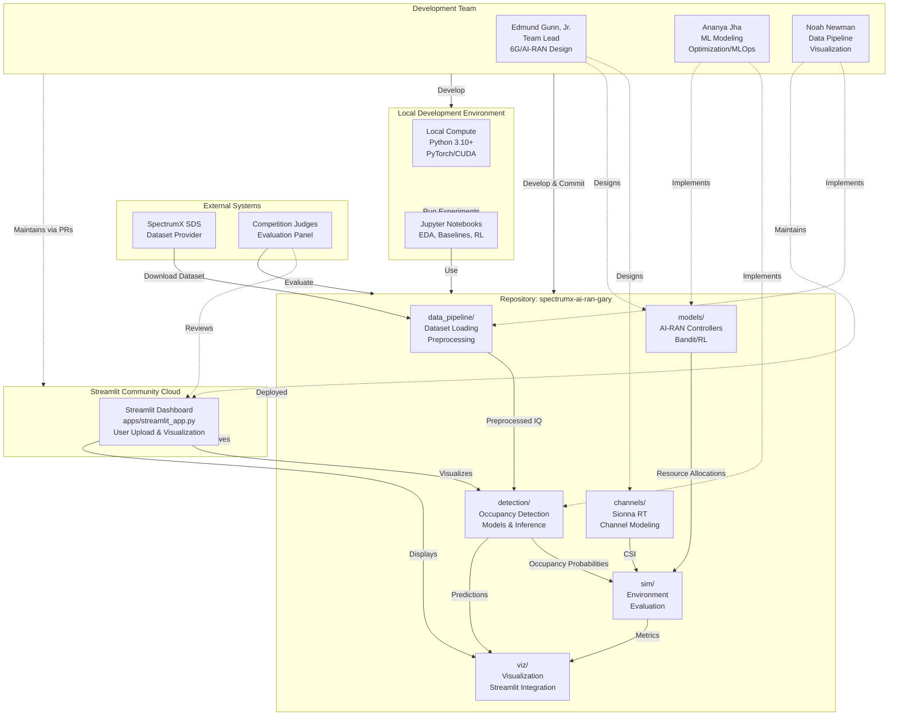

# LEGACY — system context (superseded)

| | |
|---|---|
| **Status** | **Legacy** — do not use for post-project accuracy |
| **Why archived** | Wrong repo topology; RL/notebooks and old package names over-emphasized vs. current `submissions/*/main.py` + Streamlit truth. |
| **Source** | [`docs/uml/system_context.mmd`](../system_context.mmd) |
| **Prefer** | [System context (current)](../current/system_context_current.md) |

[← Legacy index](index.md)
